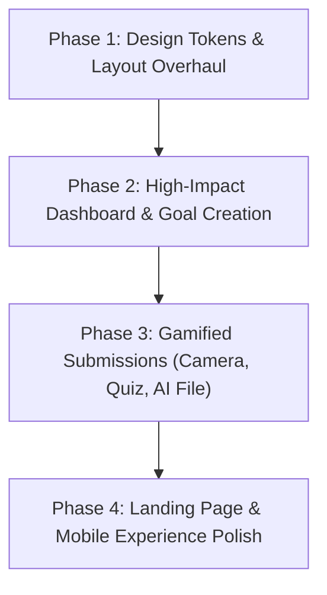

# 🔍 CommitX — Comprehensive UI/UX Audit & Redesign Blueprint

> **Date:** August 23, 2026  
> **Product:** CommitX (Real-Stake Accountability Platform)  
> **Evaluation Framework:** Jakob Nielsen's Usability Heuristics, Modern Fintech UX Standards, Cognitive Friction Index, Visual Hierarchy & Accessibility (WCAG 2.1 AA).

---

## 1. Executive Summary & UX Scorecard

The current CommitX interface was built around a *"Terra / Rooted Warmth"* earthy theme (`#4a7c59` forest green, `#faf6f0` beige, `#6b6358` warm stone, and `Literata` serif font). While intended to feel organic and calm, **it fundamentally conflicts with the psychology of a high-stakes financial accountability app.** 

Users making financial commitments need to feel **energy, urgency, precision, transparency, and rock-solid fintech security.** The current aesthetic feels sluggish, low-contrast, and dated (like a 2012 blog or recipe app rather than a cutting-edge 2026 AI-driven commitment vault).

```
┌─────────────────────────────────────────────────────────────┐
│                   UX HEALTH SCORECARD                       │
├──────────────────────────┬──────────┬───────────────────────┤
│ Metric                   │ Score    │ Status                │
├──────────────────────────┼──────────┼───────────────────────┤
│ Visual Appeal & Wow      │ 3.2 / 10 │ 🚨 Urgent Redesign    │
│ Visual Hierarchy & Clarity│ 4.5 / 10 │ ⚠️ Sub-optimal        │
│ High-Stakes Urgency & Trust│ 3.8 / 10 │ 🚨 Needs Overhaul    │
│ Mobile Touch & Ergonomics │ 5.0 / 10 │ ⚠️ Average            │
│ Gamification & Feedback   │ 4.2 / 10 │ ⚠️ Basic              │
│ Color Contrast (WCAG AA)  │ 6.1 / 10 │ ⚠️ Low in key places  │
└──────────────────────────┴──────────┴───────────────────────┘
```

---

## 2. Core Architectural & Aesthetic Flaws

### 🎨 Flaw A: Muddy, Low-Energy Color Palette
- **The Issue:** The background is an off-white beige (`#faf6f0`), surfaces are grayish-tan (`#eae6de`, `#f0ece4`), and primary green is muted olive (`#4a7c59`).
- **The Impact:** It lacks visual pop, looks dusty on OLED/Retina screens, and fails to draw the eye to critical action triggers (e.g., *“Submit Proof within 2h”*, *“Lock Stake”*).
- **The Solution:** Adopt a **high-precision Modern Fintech palette**:
  - Deep Slate / Pure Obsidian dark mode & Crisp Porcelain light mode.
  - Vibrant Emerald (`#10B981` / `#059669`) for positive stakes & verified refunds.
  - Electric Amber (`#F59E0B`) for active escrow & urgency timers.
  - High-visibility Rose/Crimson (`#F43F5E`) for forfeitures & warnings.
  - Sleek glassmorphism (`backdrop-blur-xl`, subtle 1px border glows).

---

### 🔤 Flaw B: Misapplied Typography (`Literata` Serif Everywhere)
- **The Issue:** `Literata` (a serif book font) is used for headers, numbers, statistics, and buttons.
- **The Impact:** Serif fonts in fintech dashboards make numerical stats (`₹4,250`, `94%`, `08h 45m 12s`) hard to scan quickly, reducing legibility and modern tech credibility.
- **The Solution:**
  - **Display / Headers:** `Plus Jakarta Sans` or `Outfit` (bold, geometric, authoritative).
  - **Data / Metrics / Numbers:** `JetBrains Mono` or tabular `Inter` for crisp, aligned figures.
  - **Body / Labels:** `Inter` or `Plus Jakarta Sans` for maximum readability.

---

### ⏱️ Flaw C: Lack of Tactile Urgency & Feedback
- **The Issue:** Countdown timers look like plain text badges; stake forfeitures feel like passive log items; submission results are static text blocks.
- **The Impact:** Accountability apps succeed when users feel a healthy, motivating pulse of urgency and visceral satisfaction when winning back their money.
- **The Solution:**
  - Live pulse animations (`animate-pulse`, circular progress rings).
  - Sound/haptic triggers on verification pass + animated money-back vault unlocks.
  - Interactive multi-milestone timeline track.

---

## 3. Screen-by-Screen Detailed Audit

### 🏠 1. Landing Page (`/`)
| Current Pain Points | Proposed Redesign Solution |
| :--- | :--- |
| **Hero Visual:** An abstract green blob with no product preview. | **Interactive Product Sandbox:** 3D interactive floating card showing a live commitment ticket: *"₹500 Staked • 4/5 Tasks Done • Next verification in 01h 32m"*. |
| **No Interactive Stake Simulator:** Users have to guess how stakes and verification work before signing up. | **Live Stake Calculator Widget:** Users slide amount (₹100 to ₹10,000), pick habit/study/work, and see projected success rate & refund breakdown. |
| **Missing Social Proof:** Zero live counter of active stakes or money refunded. | **Live Vault Ticker:** *"₹1,42,500 safely returned to committed users this week"*. |

---

### 📊 2. User Dashboard (`/dashboard`)
| Current Pain Points | Proposed Redesign Solution |
| :--- | :--- |
| **Hero Deadline Banner:** Flat tan card with small text. | **High-Urgency "Active Vault" Card:** Sleek dark card with an emerald glowing border, live countdown timer, and a 1-click **"Verify Now"** hero button. |
| **Stat Cards:** 3 plain cards with raw numbers without visual graphs or sparklines. | **Fintech Metric Tiles:** 4 dynamic metric tiles with mini sparkline charts, streak badges, and net savings recovered. |
| **Goal Cards:** Linear progress bar with low contrast. | **Circular Progress Rings & Milestone Chips:** Visual milestone path (e.g. Day 1 ✅, Day 2 ✅, Day 3 ⏳, Day 4 🔒). |
| **Treasury Logs:** Flat list without status badges or transaction details. | **Ledger Drawer:** Interactive transaction cards with download receipt / dispute shortcuts. |

---

### 🧙‍♂️ 3. Goal Creation Wizard (`/goals/new`)
| Current Pain Points | Proposed Redesign Solution |
| :--- | :--- |
| **Step 1 (Category Selection):** Small radio cards with basic icons. | **Rich Category Cards:** 3 large visual cards with custom vector illustrations, clear explanation of verification mechanism, and tag badges. |
| **Step 2 (Milestone Builder):** Generic list input that feels tedious. | **Visual Calendar / Timeline Builder:** Quick presets (*"Daily for 7 days"*, *"Mon-Wed-Fri"*, *"Weekly Milestone"*) with auto-distributed stake amounts per task. |
| **Step 3 (Payment & Review):** Plain summary without visual stake breakdown. | **Escrow Guarantee Lock Screen:** Visual trust breakdown: *"₹1,000 total stake = ₹200 per milestone × 5 milestones. 100% refunded upon verification."* |

---

### 📸 4. Proof Submission Flow (`/goals/[id]/tasks/[taskId]/submit`)
| Verification Mode | Current Issues | Redesign Transformation |
| :--- | :--- | :--- |
| **Camera Proof** | Plain square with dark background. No guidelines or live camera framing. | **Fintech Viewfinder HUD:** Real-time camera viewfinder with corner alignment brackets, GPS coordinate lock HUD, live timestamp watermark preview, and shutter animation. |
| **AI Study Quiz** | Static 5-card list that feels like a school test. | **Duolingo-style Interactive Quiz:** 1 question at a time with smooth slide transitions, instant sound/color feedback, countdown timer per question, and celebration score screen. |
| **Deliverable / Code** | Plain form with URL text input. | **Rich Artifact Inspector:** Auto-detects GitHub commits, Figma previews, or Google Docs, displays rich favicon preview, and live AI streaming evaluation bar. |

---

### ⚖️ 5. Disputes & Admin Queue (`/disputes`, `/admin`)
| Current Pain Points | Proposed Redesign Solution |
| :--- | :--- |
| **Dispute List:** Plain table-like list. | **Resolution Stepper:** Visual timeline: *Submitted $\rightarrow$ Under Review $\rightarrow$ Evidence Checked $\rightarrow$ Refund/Forfeit Executed*. |
| **Admin Review Queue:** Raw JSON/text data layout. | **Split-Pane Review Station:** Left side = Task requirements & AI confidence score; Right side = User submitted image/artifact with 1-click **Approve (Refund)** or **Reject (Forfeit)** keys. |

---

## 4. Proposed Design System: "CommitX Obsidian & Emerald"

### 🎨 Color Palette Tokens
```css
/* Core Surfaces (Dark Mode First / Crisp Light Mode) */
--bg-app: #090D10;              /* Obsidian Deep Base */
--surface-card: #12181E;        /* Elevated Slate Card */
--surface-glass: rgba(18, 24, 30, 0.75); /* Glassmorphism */
--surface-border: #1E293B;      /* Crisp 1px outline */

/* Brand & Status Accents */
--accent-emerald: #10B981;      /* Verified / Refund / Success */
--accent-emerald-glow: rgba(16, 185, 129, 0.25);
--accent-amber: #F59E0B;        /* Escrow / Active / Timer */
--accent-rose: #F43F5E;         /* Forfeit / Reject / Error */
--accent-cyan: #06B6D4;         /* AI Engine / Analytics */

/* Typography */
--font-sans: 'Plus Jakarta Sans', -apple-system, sans-serif;
--font-mono: 'JetBrains Mono', monospace;
```

---

## 5. Prioritized Redesign Implementation Roadmap



### Phase 1: Foundation (Design Tokens & Global Shell)
1. Replace muted palette with **Obsidian & Emerald Fintech Design System**.
2. Upgrade typography to `Plus Jakarta Sans` + `JetBrains Mono`.
3. Build reusable glassmorphism cards, glowing badges, and micro-interaction buttons.
4. Upgrade `TopNavBar` and `BottomNavBar` with active glowing indicators.

### Phase 2: Core Experience (Dashboard & Goal Wizard)
1. Redesign `/dashboard` with Active Commitment Hero card, streak tracker, and financial breakdown.
2. Redesign `/goals/new` with interactive category pickers and auto-distributing milestone calendar.
3. Redesign `/goals/[id]` with visual milestone roadmap.

### Phase 3: Submissions & AI Interaction
1. Overhaul `CameraCapture.tsx` with high-tech HUD framing and shutter animation.
2. Overhaul `QuizSubmission.tsx` into a gamified, step-by-step quiz experience.
3. Overhaul `FileSubmission.tsx` with live URL metadata previews and streaming AI analysis.

### Phase 4: Landing Page & Polish
1. Redesign `/` landing page with live interactive stake simulator and animated vault statistics.
2. Add micro-interactions, sound effects (optional toggle), and celebratory payout animations.

---
*Audit compiled by Antigravity IDE UI/UX Design Engine.*
